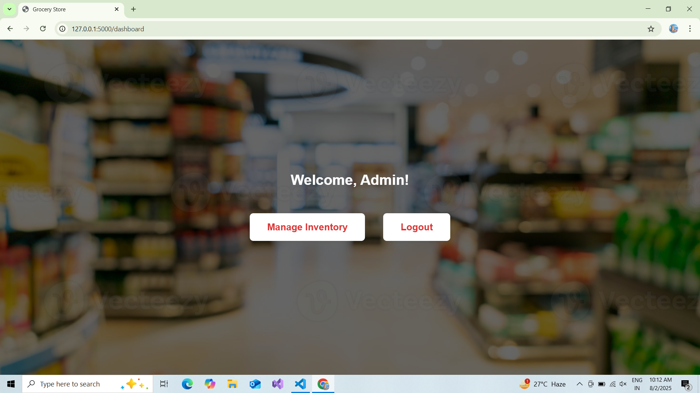

## Grocery Store Billing and Inventory Management System

This is a web-based application for managing grocery store inventory and billing, built with Python, Flask, and SQLite. It provides secure authentication, role-based dashboards, and efficient product management for both admins and cashiers.

### Features
- User registration and login with role-based access (admin/cashier)
- Add, update, and delete products in inventory
- Real-time inventory tracking
- Automated billing and bill summary generation
- Separate dashboards for admin and cashier roles

### Technologies Used
- Python
- Flask
- SQLite
- SQLAlchemy
- HTML, CSS, Jinja2

### Screenshots
Below are some example screenshots of the application:

**Login Page**


**Dashboard (Admin)**


**Inventory Management**


**Billing Page**


**Bill Summary**


> Place your actual screenshot images in the `images/` folder and update the file names above as needed.

### Setup Instructions
1. Clone the repository:
   ```
   git clone https://github.com/yourusername/your-repo-name.git
   ```
2. Install dependencies:
   ```
   pip install -r requirements.txt
   ```
3. Run the application:
   ```
   python app.py
   ```

---
Feel free to contribute or customize for your own grocery store needs!
